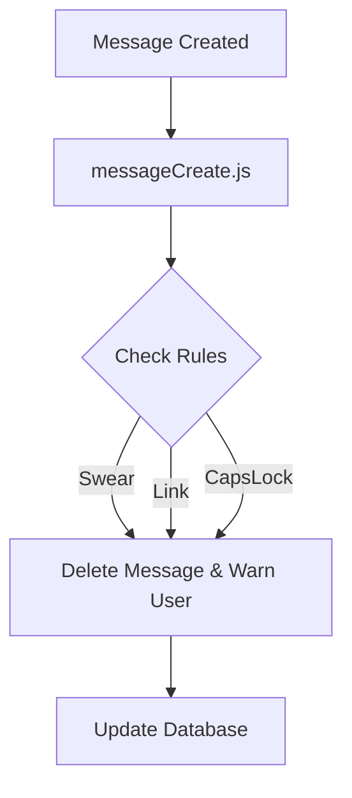

# 🛡️ Automod System

An advanced **Discord Auto-Moderation System**. Automatically protects your server based on predefined rules, detects unwanted messages, and warns users accordingly.

---

## 📁 Project Structure

```bash
Automod System/
├── otomod.js                 # Main entry point
├── Database/
│   └── otomod.json           # Blacklist, filters, etc.
├── Events/
│   └── Message/
│       └── messageCreate.js  # Handles message events
└── Settings/
    └── emojiler.json         # Custom emoji configurations
```

---

## ⚙️ Features

| Feature                   | Description |
|--------------------------|-------------|
| 🚫 Swear Filter          | Blocks predefined swear words |
| 🔗 Link Blocker          | Prevents unauthorized link sharing |
| 🆎 Caps Lock Filter      | Restricts messages written in full caps |
| ⚠️ Warning System        | Warns users who violate the rules |
| 🎭 Emoji Notifications   | Sends moderation feedback using custom emojis |

---

## 🛠️ Installation

1. Clone the repository:
```bash
git clone https://github.com/ArviiSoft/automod-system.git
```

2. Install dependencies:
```bash
npm install
```

3. Configure your bot token and settings in `otomod.js`.

4. Start the bot:
```bash
node otomod.js
```

---

## 🧠 How It Works



---

## 🧩 Notes
- `emojiler.json` contains emoji IDs used for moderation responses.
- `otomod.json` stores rules and blacklist in JSON format.

---

## 🤝 Contributing
Pull requests and suggestions are always welcome.

---

## 🪪 License
This project is licensed under the MIT License. See the `LICENSE` file for details.

---